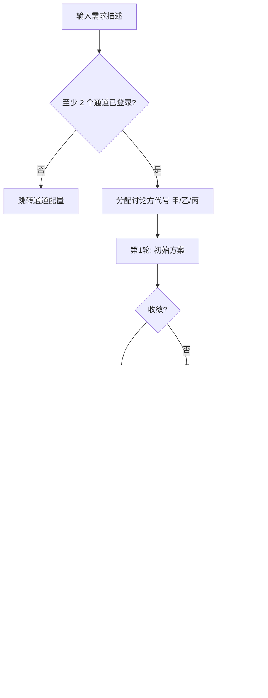

# 研讨流程与提示词说明

> 更新：2026-06-14

本文档说明方案研讨台的完整流程、各轮提示词目标、整理服务、收敛检测与输出物结构。

---

## 一、整体流程



每轮结束后：

1. **收敛检测**：计算各方方案相似度，与本场阈值比较
2. **轮次整理**（异步）：整理服务归纳本轮各方材料
3. **快照持久化**：JSON 快照支持崩溃恢复与历史查阅

研讨结束后（异步）：

4. **产出文档**：按勾选类型逐项生成完整 Markdown 文档

---

## 二、Web 控制台

页面结构（`static/index.html`）：

| 页签 | 说明 |
|------|------|
| **新建研讨** | 默认首页；配置需求、轮数、收敛阈值、API Key、产出文档 |
| **通道配置** | 三通道登录/检测/清除；不足 2 个时无法停留新建研讨 |
| **研讨详情** | 进度时间线、轮次材料、产出文档预览（Markdown 渲染）与下载 |
| **研讨历史** | 本机历次研讨记录 |

---

## 三、讨论方代号

| 规则 | 说明 |
|------|------|
| UI 展示 | 通道甲 = ChatGPT，通道乙 = DeepSeek，通道丙 = Gemini |
| 研讨内 | 仅使用讨论方甲、讨论方乙、讨论方丙 |
| 分配时机 | 排除未登录/失败平台后，按平台顺序分配 |
| 2 人研讨 | 仅甲、乙；审阅轮只包含 1 位其他讨论方 |
| 提示词 | 不出现厂商或模型名称 |

实现类：`prompts/DebatePromptBuilder.java`

---

## 四、各轮提示词

模板目录：`src/main/resources/templates/debate/`

### 第 1 轮 — 初始方案（`initial-prompt.st`）

各讨论方独立输出完整实现方案：需求理解、架构、技术选型、接口/数据、实施计划、风险等。

### 第 2 轮 — 交叉审阅（`critique-prompt.st`）

审阅其他讨论方方案：覆盖度、架构合理性、可落地性、风险盲区，输出修订建议。

### 第 3+ 轮 — 修订回应（`rebuttal-prompt.st`）

回应审阅意见，输出修订版方案与当前推荐摘要。

### 收敛轮 — 收敛确认（`convergence-check.st`）

评估各方趋同程度，输出共识/分歧与综合推荐方案摘要。

---

## 五、收敛检测

实现类：`convergence/TextSimilarityConvergenceDetector.java`

| 步骤 | 说明 |
|------|------|
| 预处理 | 去除 Markdown 噪声（代码块、标题符号等） |
| 分词 | 中文连续汉字二元组 + 英文单词 |
| 加权 | TF-IDF，降低各方案共有模板词权重 |
| 相似度 | 所有两两组合的余弦相似度 |
| 取值 | **min(pairwise)**，防止平均掩盖分歧 |
| 惩罚 | 中英文否定/转折词命中时扣减 |
| 判定 | `minPairwise >= session.convergenceThreshold` |

阈值配置：

- UI：50%~100% 滑块/数字输入，存 localStorage
- API：`convergenceThreshold` 0.5~1.0
- 研讨详情展示本场配置的阈值百分比

---

## 六、整理服务（必选）

### 配置要求

- 发起研讨**必须**提供 `judgeApiKey`
- `judgeEnabled` 默认 `true`，有 Key 时强制启用
- Key 仅存内存（`DebateJudgeService.sessionApiKeys`），**不写入快照**

### 轮次整理（`templates/judge/round-system-prompt.txt`）

每轮异步执行，输出：

- 本轮概览
- 各讨论方整理（提示词意图、方案要点）
- 材料中的共识与分歧

**整理原则**：仅客观摘录归纳，禁止整理者添加意见、评价或褒贬。

### 产出文档（`templates/output-documents/*.txt`）

研讨结束后由 `OutputDocumentService` 逐项生成，详见 [OUTPUT-DOCUMENTS.md](OUTPUT-DOCUMENTS.md)。

不再使用旧的 `summarizeFinal` 最终裁判作为主输出；主输出为勾选的产出文档列表。

---

## 七、输出物

### 1. 产出文档（主输出）

| API | 说明 |
|-----|------|
| `GET /api/debates/output-document-types` | 全部类型及用途说明 |
| `GET /api/debates/{id}/documents` | 本场列表与状态 |
| `GET /api/debates/{id}/documents/{typeId}` | 下载 Markdown |

### 2. 兼容报告

| API | 说明 |
|-----|------|
| `GET /api/debates/{id}/report` | 优先返回 `implementation_plan_full`；否则回退 `SynthesisGenerator` |

### 3. 轮次整理材料

| API | 说明 |
|-----|------|
| `GET /api/debates/{id}/judge` | 各轮提示词、回答、整理结果 |

### 4. 快照文件

- 每轮及赛后由 `DebateStateStore` 持久化
- 旧快照可能缺少 `outputDocumentTypes` / `generatedDocuments` 字段

---

## 八、需求描述撰写建议

```
【背景】当前系统状况或业务场景
【目标】要实现什么功能，解决什么问题
【范围】明确做/不做什么
【约束】性能、安全、兼容性、技术栈限制、工期等
【验收】怎样算做完、可测试的验收标准
```

**示例**：

> 为电商系统实现订单超时自动取消功能。订单创建后 N 分钟未支付自动关闭（N 可配置）。
> 需支持分布式部署，取消后回滚库存并发送 MQ 通知。
> 不做退款流程（由支付模块处理）。要求 99.9% 可靠性，配置热更新。

---

## 九、自定义与扩展

| 目标 | 修改位置 |
|------|----------|
| 各轮研讨结构 | `templates/debate/*.st` |
| 审阅维度 | `DebatePromptBuilder.buildCritiqueInstructions()` |
| 轮次整理格式 | `templates/judge/*.txt` |
| 产出文档结构 | `templates/output-documents/*.txt` |
| 新增产出类型 | `OutputDocumentType.java` + 新模板 |
| 页面选择器 | `selectors/*.yml` |

修改后需**重启服务**生效。

---

## 十、相关源码索引

| 模块 | 路径 |
|------|------|
| 编排核心 | `orchestrator/DebateOrchestrator.java` |
| 收敛检测 | `convergence/TextSimilarityConvergenceDetector.java` |
| 提示词构建 | `prompts/DebatePromptBuilder.java` |
| 轮次整理 | `judge/DebateJudgeService.java` |
| 产出文档 | `judge/OutputDocumentService.java` |
| 正文清洗 | `judge/DocumentContentSanitizer.java` |
| 进度展示 | `service/DebateProgressBuilder.java` |
| 兼容报告 | `reporting/SynthesisGenerator.java` |
| Web 控制台 | `resources/static/index.html` |
| 桌面菜单 | `electron/app-menu.js` |
