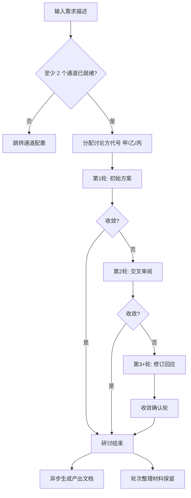

# 研讨流程与提示词说明

> 更新：2026-06-15

本文档说明方案研讨台的完整流程、各轮提示词目标、整理服务、收敛检测与输出物结构。

---

## 一、整体流程



每轮结束后：

1. **收敛检测** — 计算各方方案相似度，与本场阈值比较
2. **轮次整理**（异步）— 整理服务归纳本轮各方材料
3. **快照持久化** — JSON 快照支持崩溃恢复与历史查阅

研讨结束后（异步）：

4. **产出文档** — 按勾选类型逐项生成完整 Markdown 文档

---

## 二、Web 控制台

前端基于 **Vue 3 ESM**（`static/js/`），入口为 `index.html`。

### 页签结构

| 页签 | 说明 |
|------|------|
| **新建研讨** | 默认首页；三步向导（研讨描述 → 研讨参数 → 参与讨论方） |
| **通道配置** | 内置通道浏览器登录/检测；自定义 API 通道增删改与连通性检测；整理服务 API 配置 |
| **研讨历史** | 左侧列表 + 右侧详情（master-detail）；含进度时间线、轮次材料、产出文档预览 |

> 原独立「研讨详情」页签已合并入「研讨历史」。桌面端快捷键：`Ctrl+1` 新建研讨、`Ctrl+2` 通道配置、`Ctrl+3` 研讨历史。

### 新建研讨向导

| 步骤 | 内容 |
|------|------|
| 1. 研讨描述 | 需求描述（功能目标、范围、验收标准） |
| 2. 研讨参数 | 最大轮数、收敛阈值、整理方式（API / 通道）、产出文档勾选 |
| 3. 参与讨论方 | 勾选就绪通道、自定义讨论方名称；至少 2 个、至多全部就绪通道 |

提交成功后自动跳转「研讨历史」并打开对应详情。

### 研讨历史详情

- **列表**：最近 30 条记录；进行中研讨每 30 秒静默轮询；支持按主题/任务编号搜索，回车直开 UUID
- **详情**：嵌入 `DebateDetail` 组件，`v-show` 保活避免切页丢失状态
- **时间线**：默认折叠，通过「研讨进度」按钮展开/收起
- **文档预览**：Markdown 渲染 + 目录导航气泡弹窗；切换文档自动预览
- **聊天区**：按 session 记忆滚动位置

---

## 三、讨论方代号

| 规则 | 说明 |
|------|------|
| UI 展示 | 通道甲 = ChatGPT，通道乙 = DeepSeek，通道丙 = Gemini |
| 研讨内 | 仅使用「讨论方甲」「讨论方乙」「讨论方丙」 |
| 分配时机 | 用户勾选就绪通道；未指定时默认全部内置通道 |
| 自定义名称 | `participantAliases` 支持按通道 ID 自定义名称 |
| 2 人研讨 | 仅甲、乙参与；审阅轮只包含 1 位其他讨论方 |
| 提示词 | 全程不出现厂商或模型名称 |

实现类：`prompts/DebatePromptBuilder.java`

---

## 四、通道配置

实现类：`service/ChannelRegistryService.java`，持久化至 `~/.ai-debate-arena/channels.json`。

### 内置通道

内置通道不可删除，默认接入方式为浏览器。

| ID | 平台 | 接入方式 | 展示名 |
|----|------|----------|--------|
| `chatgpt` | CHATGPT | 浏览器 | ChatGPT |
| `deepseek` | DEEPSEEK | 浏览器 | DeepSeek |
| `gemini` | GEMINI | 浏览器 | Gemini |

操作流程：「登录」→ 在独立浏览器窗口完成认证 →「检测」确认登录态 →「清除」移除 Profile。

### 自定义 API 通道

- 最多 8 个，ID 格式 `api-{uuid8}`
- 须填写名称、Base URL、API Key、模型
- **检测连接成功**（`apiVerified = true`）后方可参与研讨
- 修改 API 参数后验证状态自动清除，须重新检测

### 就绪判定（`ready`）

| 通道类型 | 就绪条件 |
|----------|----------|
| 浏览器 | Profile 有效 + 登录验证通过 |
| API | Key / BaseURL / Model 齐全 + `apiVerified = true` |

### 整理服务 API

全局配置存于 `~/.ai-debate-arena/api-config.json`，可在「通道配置」页保存与检测。新建研讨时若未手动填写 Key，自动复用全局配置。

---

## 五、浏览器生命周期

实现类：`browser/BrowserProcessCleaner.java`、`browser/PlaywrightManager.java`

服务被强制终止时 `@PreDestroy` 可能来不及执行，导致 Chromium 残留占用 Profile。防护机制：

1. **启动清理** — `ApplicationReadyEvent` 时扫描并终止命令行含 Profile 路径的残留 chrome/chromium 进程，清除 `SingletonLock` 等锁文件
2. **JVM Shutdown Hook** — 在进程退出时尽量关闭 Playwright 资源
3. **启动重试** — `launchPersistentContext` 检测到 Profile 占用时自动清理并重试
4. **健康检查重试** — `ProfileController` 临时检测失败时同样触发清理

---

## 六、各轮提示词

模板目录：`src/main/resources/templates/debate/`

### 第 1 轮 — 初始方案（`initial-prompt.st`）

各讨论方独立输出完整实现方案，涵盖：需求理解、架构设计、技术选型、接口/数据模型、实施计划、风险识别。

### 第 2 轮 — 交叉审阅（`critique-prompt.st`）

审阅其他讨论方方案，评估维度：覆盖度、架构合理性、可落地性、风险盲区。输出修订建议。

### 第 3+ 轮 — 修订回应（`rebuttal-prompt.st`）

回应审阅意见，输出修订版方案与当前推荐摘要。

### 收敛轮 — 收敛确认（`convergence-check.st`）

评估各方趋同程度，输出共识/分歧与综合推荐方案摘要。

---

## 七、收敛检测

实现类：`convergence/TextSimilarityConvergenceDetector.java`

| 步骤 | 说明 |
|------|------|
| 预处理 | 去除 Markdown 噪声（代码块、标题符号等） |
| 分词 | 中文连续汉字二元组 + 英文单词 |
| 加权 | TF-IDF，降低各方案共有模板词权重 |
| 相似度 | 所有两两组合的余弦相似度 |
| 取值 | **min(pairwise)**，防止平均值掩盖分歧 |
| 惩罚 | 中英文否定/转折词命中时扣减相似度 |
| 判定 | `minPairwise >= session.convergenceThreshold` |

阈值配置：

- UI：50%~100% 滑块/数字输入，存 localStorage
- API：`convergenceThreshold` 0.5~1.0
- 研讨详情展示本场配置的阈值百分比

---

## 八、整理服务（必选）

### 配置要求

- 发起研讨**必须**启用整理（`judgeEnabled = true`）
- **API 整理**（`judgeMode = API`）：须提供 `judgeApiKey` 或已在通道配置页保存全局 API Key
- **通道整理**（`judgeMode = CHANNEL`）：须指定 `judgeChannel`（已登录的浏览器平台）
- 研讨快照**不保存** API Key

### 轮次整理（`templates/judge/round-system-prompt.txt`）

每轮异步执行，输出：

- 本轮概览
- 各讨论方整理（提示词意图、方案要点）
- 材料中的共识与分歧

> **整理原则**：仅客观摘录归纳，禁止整理者添加意见、评价或褒贬。

### 产出文档（`templates/output-documents/*.txt`）

研讨结束后由 `OutputDocumentService` 逐项生成，详见 [OUTPUT-DOCUMENTS.md](OUTPUT-DOCUMENTS.md)。

不再使用旧的 `summarizeFinal` 最终裁判作为主输出；主输出为勾选的产出文档列表。

---

## 九、输出物

### 1. 产出文档（主输出）

| API | 说明 |
|-----|------|
| `GET /api/debates/output-document-types` | 全部类型及用途说明 |
| `GET /api/debates/{id}/documents` | 本场文档列表与生成状态 |
| `GET /api/debates/{id}/documents/{typeId}` | 下载 Markdown 正文 |

### 2. 兼容报告

| API | 说明 |
|-----|------|
| `GET /api/debates/{id}/report` | 优先返回 `implementation_plan_full`；否则回退 `SynthesisGenerator` |

### 3. 轮次整理材料

| API | 说明 |
|-----|------|
| `GET /api/debates/{id}/judge` | 各轮提示词、回答、整理结果 |

### 4. 快照文件

- 每轮及赛后由 `DebateStateStore` 持久化
- 旧快照可能缺少 `outputDocumentTypes` / `generatedDocuments` 等新增字段

---

## 十、需求描述撰写建议

```
【背景】当前系统状况或业务场景
【目标】要实现什么功能，解决什么问题
【范围】明确做/不做什么
【约束】性能、安全、兼容性、技术栈限制、工期等
【验收】怎样算做完、可测试的验收标准
```

**示例**：

> 为电商系统实现订单超时自动取消功能。订单创建后 N 分钟未支付自动关闭（N 可配置）。
> 需支持分布式部署，取消后回滚库存并发送 MQ 通知。
> 不做退款流程（由支付模块处理）。要求 99.9% 可靠性，配置热更新。

---

## 十一、自定义与扩展

| 目标 | 修改位置 |
|------|----------|
| 各轮研讨结构 | `templates/debate/*.st` |
| 审阅维度 | `DebatePromptBuilder.buildCritiqueInstructions()` |
| 轮次整理格式 | `templates/judge/*.txt` |
| 产出文档结构 | `templates/output-documents/*.txt` |
| 新增产出类型 | `OutputDocumentType.java` + 新模板 |
| 页面选择器 | `selectors/*.yml` |
| 通道注册逻辑 | `ChannelRegistryService.java` |
| Web 组件 | `static/js/components/*.js` |
| 桌面菜单快捷键 | `electron/app-menu.js` |

修改后需**重启服务**生效。

---

## 十二、相关源码索引

| 模块 | 路径 |
|------|------|
| 编排核心 | `orchestrator/DebateOrchestrator.java` |
| 收敛检测 | `convergence/TextSimilarityConvergenceDetector.java` |
| 提示词构建 | `prompts/DebatePromptBuilder.java` |
| 轮次整理 | `judge/ApiJudgeService.java` |
| 产出文档生成 | `judge/OutputDocumentService.java` |
| 正文清洗 | `judge/DocumentContentSanitizer.java` |
| 通道注册表 | `service/ChannelRegistryService.java` |
| 参与方选择 | `service/ParticipantSelectionHelper.java` |
| 浏览器清理 | `browser/BrowserProcessCleaner.java` |
| Playwright 管理 | `browser/PlaywrightManager.java` |
| 进度展示 | `service/DebateProgressBuilder.java` |
| 兼容报告 | `reporting/SynthesisGenerator.java` |
| Web 根组件 | `static/js/App.js` |
| 新建研讨向导 | `static/js/components/DebateForm.js` |
| 研讨历史 | `static/js/components/HistoryPanel.js` |
| 通道配置 | `static/js/components/ProfilesPanel.js` |
| 研讨详情 | `static/js/components/DebateDetail.js` |
| 桌面菜单 | `electron/app-menu.js` |
